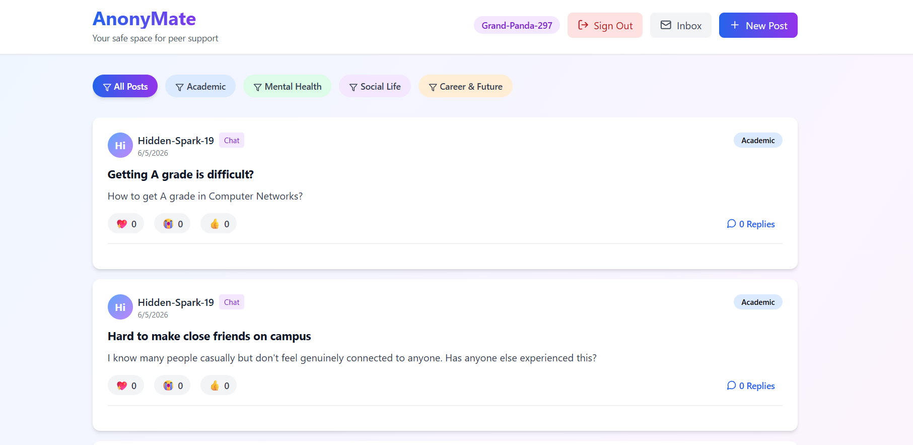
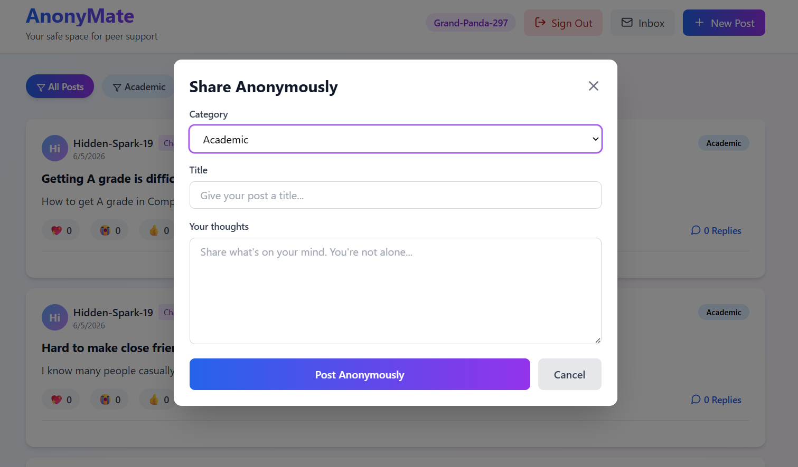
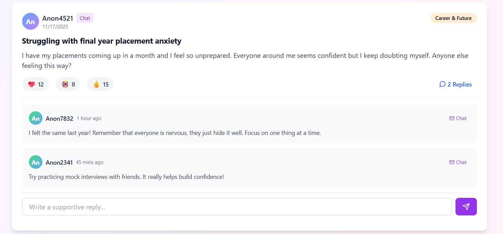
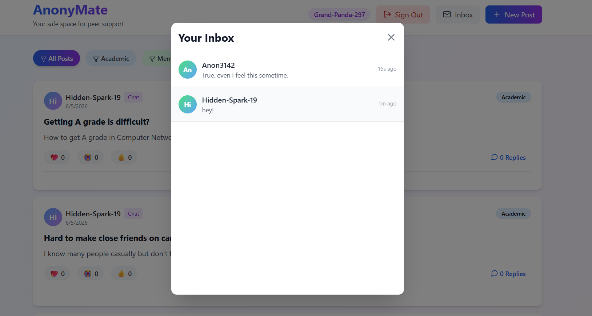

# AnonyMate – Anonymous Student Peer Support Platform

## Overview

AnonyMate is a peer-to-peer anonymous support platform designed for students to share academic, mental health, social, and career-related concerns in a safe environment. The platform enables students to seek advice, connect with peers, and engage in meaningful conversations while maintaining anonymity.

## Features

### Anonymous Posting

* Create posts without revealing personal identity
* Category-based discussions:

  * Academic
  * Mental Health
  * Social Life
  * Career & Future

### Community Engagement

* React to posts using supportive reactions
* View community responses and engagement metrics
* Browse discussions across multiple categories

### Anonymous Messaging

* Direct anonymous peer-to-peer conversations
* Inbox for managing conversations
* Safe communication without exposing user identity

### Authentication

* Firebase Anonymous Authentication
* Secure user sessions
* Protected database access

## Tech Stack

### Frontend

* React.js
* Vite
* Tailwind CSS

### Backend & Database

* Firebase Firestore
* Firebase Authentication

### Development Tools

* JavaScript (ES6+)
* Git
* GitHub

## Project Motivation

Many students hesitate to discuss academic stress, mental health concerns, placement anxiety, homesickness, or social challenges due to fear of judgment. AnonyMate aims to create a safe and anonymous environment where students can seek support and connect with peers facing similar experiences.

## Screenshots

### Home Feed

### Create Post

### Anonymous Chat

### Inbox

## Installation

1. Clone the repository

git clone https://github.com/rishizenn/AnonyMate.git

2. Navigate to project directory

cd AnonyMate

3. Install dependencies

npm install

4. Start development server

npm run dev

5. Open browser

http://localhost:5173

## Future Improvements

* AI-powered crisis detection
* Content moderation system
* User reporting mechanism
* Enhanced search and filtering
* Mobile responsive optimization
* Analytics dashboard

## Author

Rishi Jain

BITS Pilani

GitHub: https://github.com/rishizenn
